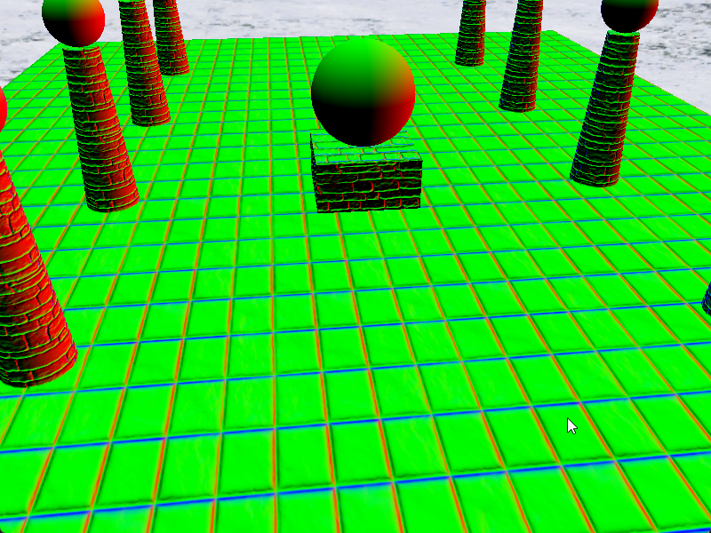

# 记录一下 学习 DirectX12 的代码

> 笔记和习题 记录在 语雀/TA/D3D
> https://www.yuque.com/yuqueyonghuc94hae/vvitgx/uwyaoliwes9ou2wd

---

# 章节

### 视锥体剔除

### 拾取

### cubemap

环境贴图 和 动态 cubemap

### normalmap

### ShadowMap

### SSAO

